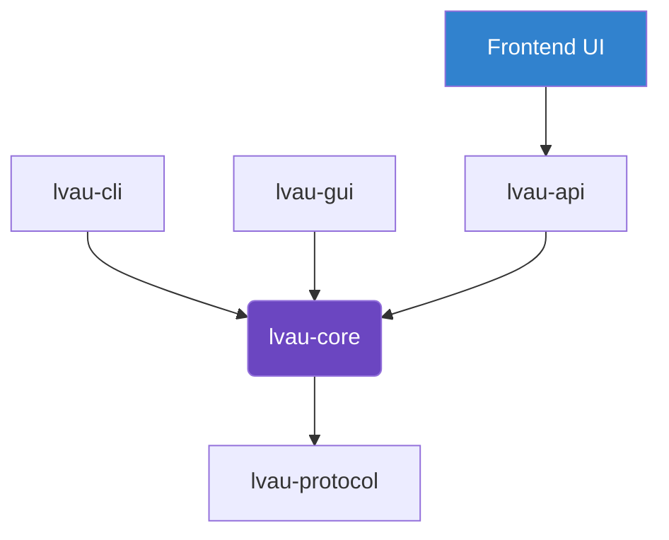

<div align="center">
  <h1>☁️ Lvau</h1>
  <p><strong>A secure-by-default, accessible local file encryption toolkit.</strong></p>
  <p><i>"Cryptography should be standard, robust, and boring. Obfuscation is secondary. UX prevents mistakes."</i></p>
  <p>English | <a href="README_ja.md">日本語 (Japanese)</a></p>

  <br/>
  
  
  
</div>

---

Lvau is a secure-by-default cryptography tool that makes modern cryptographic primitives robust and easy to use. It strictly adheres to modern, safe defaults without relying on proprietary obfuscation.

## ✨ Key Features

### 🛡EE"Boring" Security
- **XChaCha20-Poly1305 AEAD**: The default encryption algorithm. Generates a fresh 192-bit random nonce per file to make accidental nonce reuse extremely unlikely.
- **Argon2id KDF**: Hardened password hashing for deriving master keys, utilizing a unique 16-byte random salt per encryption.
- **HKDF Key Separation**: The password-derived master key is expanded safely into the file encryption key.
- **Zeroized Secrets**: Sensitive key material is zeroized where practical after use.
- **Versioned `.lvau` Envelope**: Strongly-typed envelope schema that binds all cryptography metadata via AEAD Additional Authenticated Data (AAD).

### 🧩 Future-Ready Architecture
Lvau is structurally designed to support future advancements. The `lvau-protocol` has placeholders for:
- **Asymmetric Encryption**: `X25519` for recipient key wrapping and `Ed25519` for manifest signing.
- **Post-Quantum Cryptography (PQC)**: `ML-KEM` and `ML-DSA` hybrids.
- **Operational Key Providers**: KMS/HSM abstraction interfaces. *(Note: local files are always encrypted locally).*

---

## 🚀 Installation

### Prerequisites
You need [Rust and Cargo](https://rustup.rs/) installed to build the project.

### Build Instructions
```sh
# Clone the repository
git clone https://github.com/lasder-ca/lvau.git
cd lvau

# Build the entire workspace in release mode
cargo build --release
```

---

## 📖 How to Use

Lvau can be used via the **CLI**, **GUI**, or **Server API**.

### ⚠️ Security Warning for Server API Mode
**Server API mode is NOT End-to-End Encrypted (E2EE) or Zero-Knowledge.** Files and passwords uploaded via the API are processed in memory on the API server. For highly sensitive files, you should always use the offline local CLI/GUI versions.

### Using the CLI (`lvau-cli.exe`)

The CLI uses a hidden prompt for passwords to prevent shell history leaks.

**1. Encrypt a File**
```sh
lvau-cli encrypt --in secret.txt --out encrypted.lvau --profile balanced
```

*Security Profiles available: `fast`, `balanced`, `archive`, `paranoid` (which linearly increases the Argon2id cost).*

**2. Decrypt a File**
```sh
lvau-cli decrypt --in encrypted.lvau --out secret.txt
```

**3. Inspect Envelope Metadata**
Reads the AAD metadata without decrypting the content.
```sh
lvau-cli inspect --in encrypted.lvau
```

### Using the GUI (`lvau-gui.exe`)
A cross-platform native graphical wizard is available. Simply select your target file, define your password, and execute. The telemetry strictly displays safe metadata, preventing plaintext chunk exposure.

---

## 🏗️ Workspace Architecture

Lvau is modularized into independent crates to minimize attack surface:



- `lvau-protocol`: Binary format definitions and serialization (`postcard`). Contains the strict `Envelope` specification.
- `lvau-core`: The crypto engine handling Argon2id, HKDF, and XChaCha20-Poly1305 logic via `secrecy` constraints.
- `lvau-api`: The web API backend providing upload endpoints (NOT E2EE).
- `lvau-cli`: Command-line interface via `clap`.
- `lvau-gui`: Hardware-accelerated GUI built with `egui`.
- `lvau-stub`: A minimal placeholder executable for future SFX integration capabilities.

## 📄 License
This project is licensed under the MIT License - see the [LICENSE](LICENSE) file for details.

## 🤖 AI Usage
This project primarily uses AI models such as Gemini for code generation and reviews. Any errors or issues identified in the AI-generated output are reviewed and corrected by humans.
