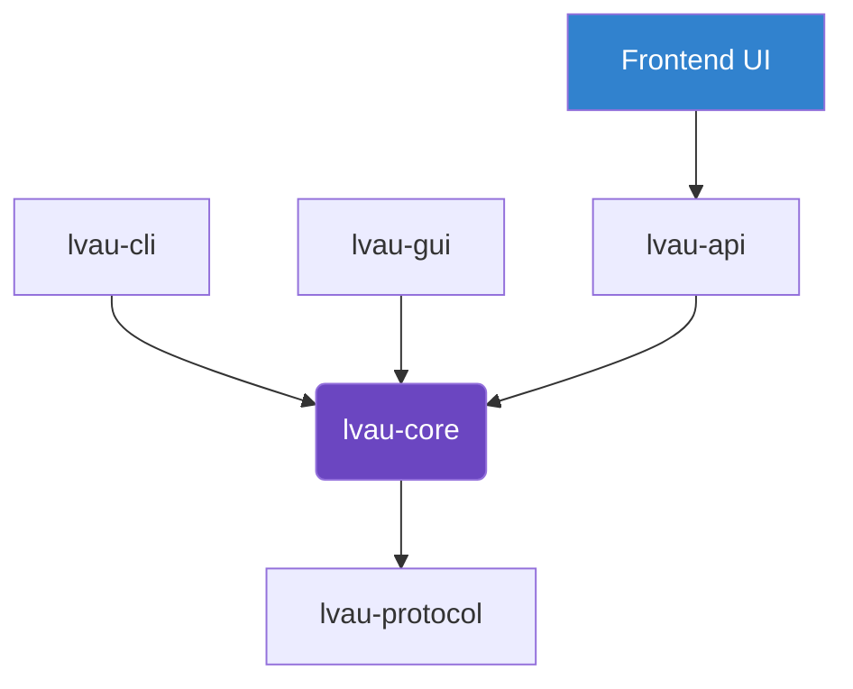

<div align="center">
  <h1>☁️ Lvau</h1>
  <p><strong>デフォルトで安全な、使いやすいローカルファイル暗号化ツールキット。</strong></p>
  <p><i>「暗号化は標準的で、堅牢で、退屈であるべきだ。難読化は二の次。UXはミスを防ぐ。」</i></p>
  <p><a href="README.md">English</a> | 日本語 (Japanese)</p>
  
  <br/>
  
  
  
</div>

---

Lvau は、最新の暗号化プリミティブを堅牢かつ使いやすくする、セキュア・バイ・デフォルトな暗号化ツールです。独自の難読化には頼らず、現代的で安全な標準に厳密に従います。

## ✨ 主な機能

### 🛡EE「退屈」なセキュリティ
- **XChaCha20-Poly1305 AEAD**: デフォルトの暗号化アルゴリズム。ファイルごとに新しい 192-bit のランダムな Nonce を生成し、偶発的な Nonce の再利用を極めて困難にします。
- **Argon2id KDF**: 暗号化ごとに固有の 16 バイトのランダムなソルトを使用する、マスターキー派生のための堅牢なパスワードハッシュ。
- **HKDF 鍵分離**: パスワードから派生したマスターキーは、ファイル暗号化キーに安全に拡張されます。
- **機密情報のゼロ化**: センシティブな鍵情報は、使用後可能な限り速やかにメモリから消去されます。
- **バージョン管理された `.lvau` エンベロープ**: すべての暗号化メタデータを AEAD の追加認証データ (AAD) にバインドする、厳密に型付けされたエンベロープスキーマ。

### 🧩 将来を見据えたアーキテクチャ
Lvau は将来の進歩に対応できるよう構造的に設計されています。`lvau-protocol` には以下のためのプレースホルダーがあります：
- **非対称暗号化**: 受信者の鍵をラップするための `X25519` と、マニフェストの署名のための `Ed25519`。
- **耐量子暗号 (PQC)**: `ML-KEM` と `ML-DSA` のハイブリッド。
- **運用キープロバイダ**: KMS/HSM 抽象化インターフェイス。*(注: ローカルファイルは常にローカルで暗号化されます)。*

---

## 🚀 インストール

### 前提条件
プロジェクトをビルドするには、[Rust と Cargo](https://rustup.rs/) をインストールする必要があります。

### ビルド手順
```sh
# リポジトリのクローン
git clone https://github.com/lasder-ca/lvau.git
cd lvau

# ワークスペース全体をリリースモードでビルド
cargo build --release
```

---

## 📖 使い方

Lvau は **CLI**、**GUI**、または **Server API** 経由で使用できます。

### ⚠️ Server API モードのセキュリティ警告
**Server API モードはエンドツーエンド暗号化（E2EE）やゼロ知識ではありません。** API経由でアップロードされたファイルとパスワードは、APIサーバー上のメモリ内で処理されます。機密性の高いファイルについては、常にオフラインのローカル CLI/GUI 版を使用してください。

### CLI の使用 (`lvau-cli.exe`)

CLI では、シェルの履歴への漏洩を防ぐため、パスワード入力は非表示のプロンプトで行われます。

**1. ファイルの暗号化**
```sh
lvau-cli encrypt --in secret.txt --out encrypted.lvau --profile balanced
```

*利用可能なセキュリティプロファイル: `fast`, `balanced`, `archive`, `paranoid` (Argon2id のコストを線形に増加させます)。*

**2. ファイルの復号**
```sh
lvau-cli decrypt --in encrypted.lvau --out secret.txt
```

**3. エンベロープメタデータの検査**
コンテンツを復号せずに AAD メタデータを読み取ります。
```sh
lvau-cli inspect --in encrypted.lvau
```

### GUI の使用 (`lvau-gui.exe`)
クロスプラットフォームのネイティブグラフィカルウィザードが利用可能です。対象ファイルを選択し、パスワードを設定して実行するだけです。テレメトリは安全なメタデータのみを厳密に表示し、平文チャンクの露出を防ぎます。

---

## 🏗️ ワークスペースアーキテクチャ

Lvau は攻撃対象領域を最小限に抑えるため、独立したクレートにモジュール化されています：



- `lvau-protocol`: バイナリフォーマットの定義とシリアライズ (`postcard`)。厳密な `Envelope` 仕様を含みます。
- `lvau-core`: `secrecy` 制約を介して Argon2id、HKDF、および XChaCha20-Poly1305 ロジックを処理する暗号化エンジン。
- `lvau-api`: アップロードエンドポイントを提供する Web API バックエンド (E2EEではありません)。
- `lvau-cli`: `clap` を使用したコマンドラインインターフェイス。
- `lvau-gui`: `egui` で構築されたハードウェアアクセラレーション GUI。
- `lvau-stub`: 将来の SFX 統合機能のための最小限のプレースホルダー実行ファイル。

## 📄 ライセンス
このプロジェクトは MIT ライセンスの下でライセンスされています - 詳細は [LICENSE](LICENSE) ファイルを参照してください。

## 🤖 AI使用について
このプロジェクトには主にGeminiなどを用いりレビュー、エラーなどは人間が修正しています。
